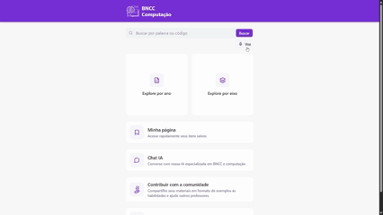

# BNCC Computação – Plataforma de Apoio com Serviços Integrados (IA e PWA)

Projeto desenvolvido para o Trabalho de Conclusão de Curso (Ciência da Computação – UFSM). Trata-se de uma continuação da plataforma previamente implementada em https://github.com/wedersonf/bncc-comp, agora com foco na integração de serviços de IA e funcionalidades PWA completas. Esta versão 2.0 é uma plataforma web com React + Vite que auxilia professores na implantação da BNCC Computação.



---

## ✨ Destaques do Projeto

- 🤖 **Integração de IA:** assistente pedagógico com `Gemini 2.5 Flash` para apoiar buscas e contextualização de habilidades BNCC (`src/hooks/use-gemini-api.ts`).
- 📱 **PWA completo:** uso offline, instalação em dispositivos, persistência de armazenamento e notificações push (`vite-plugin-pwa`, `src/sw.ts`, `src/pwa-setup.tsx`).
- 🧩 **Avaliação embutida:** fluxo de tarefas com microquestionários e envio direto para Google Sheets via conta de serviço (`api/evaluation/submit.ts`).

---

## 🧰 Tecnologias Utilizadas (versões principais)

| Tecnologia | Versão |
|-------------|---------|
| React | `19.1.0` |
| Vite | `6.2.0` |
| TypeScript | `5.8.3` |
| Tailwind CSS | `3` |
| React Router | `7.6.2` |
| React Hook Form | `7.56.4` |
| TanStack React Query | `5.76.1` |
| Tiptap Editor | `2.12.0` |
| Zod | `3.24.4` |
| Radix UI | `1.x/2.x` |
| Lucide Icons | `0.485.0` |
| Axios | `1.9.0` |
| Sonner (toasts) | `2.0.4` |
| vite-plugin-pwa | `1.0.3` + Workbox (`7.3.0`) |
| Google APIs | `googleapis` `163.0.0` |

---

## 🗂️ Estrutura de Pastas

<details>
<summary><b>Ver estrutura de pastas</b></summary>

```
api/                  # endpoints serverless (ex.: evaluation/submit.ts, push broadcast.ts/subscribe.ts)
src/
├── app-evaluation/   # módulo da avaliação integrado e isolado da UI principal
├── assets/           # imagens e recursos estáticos
├── components/       # componentes reutilizáveis
├── context/          # contextos globais (ex.: rede)
├── dtos/             # tipagens de dados
├── hooks/            # hooks personalizados (ex.: IA, voz, rede, storage)
├── layouts/          # layouts base
├── lib/              # utilitários de bibliotecas (axios, dayjs, push, react-query)
├── pages/            # páginas da aplicação
├── types/            # tipagens de dados do chat
├── utils/            # utilitários gerais
├── router.tsx        # rotas
├── providers.tsx     # providers globais
├── env.ts            # variáveis de ambiente
├── pwa-setup.tsx     # configuração PWA
└── sw.ts             # service worker
```
</details>

---

## ⚙️ Configuração de Ambiente

<details>
<summary><b>Ver variáveis necessárias</b></summary>

### 🔑 IA (Gemini)
- `VITE_GEMINI_API_KEY` — chave da API Gemini

### 🔔 Push Notifications
- `VITE_PUSH_PUBLIC_KEY` — chave pública VAPID para assinatura do push

### 📊 Google Sheets (Avaliação embutida)
- `GOOGLE_SPREADSHEET_ID` — ID da planilha  
- `GOOGLE_SERVICE_ACCOUNT_EMAIL` — e-mail da conta de serviço  
- `GOOGLE_SERVICE_ACCOUNT_PRIVATE_KEY` — chave privada da conta de serviço (com quebras de linha)
</details>

---

## 🚀 Como Executar

```bash
# Pré-requisitos
Node.js 18+ e pnpm instalado globalmente

# Instalar dependências
pnpm install
```

> Antes de rodar o projeto, copie `.env.example` para `.env` e preencha todas as variáveis de ambiente necessárias.

```bash
# Ambiente de desenvolvimento
pnpm dev

# Build de produção
pnpm build

# Preview do build
pnpm preview
```

---

## ☁️ Hospedagem

- Preparado para **Vercel**, com configuração em `vercel.json`.

---

## 🤖 Notas de Uso (IA e PWA)

### 🧠 IA
- O chat usa `Gemini 2.5 Flash` e enriquece a consulta com contexto BNCC (códigos, anos, eixos e palavras-chave).  
- Configure `VITE_GEMINI_API_KEY` no arquivo `.env`.

### 📲 PWA
- Instalação e uso offline com **precache**.  
- Assets estáticos usam **cache-first**, e dados usam **stale-while-revalidate** quando aplicável.  
- **Background Sync** envia contribuições e avaliações quando a conexão retorna.  
- **Notificações push** disponíveis após a instalação do app (modo standalone).

---

## 🤝 Contribuição

Contribuições são bem-vindas!  
Abra **issues** ou envie **pull requests** com melhorias e sugestões.