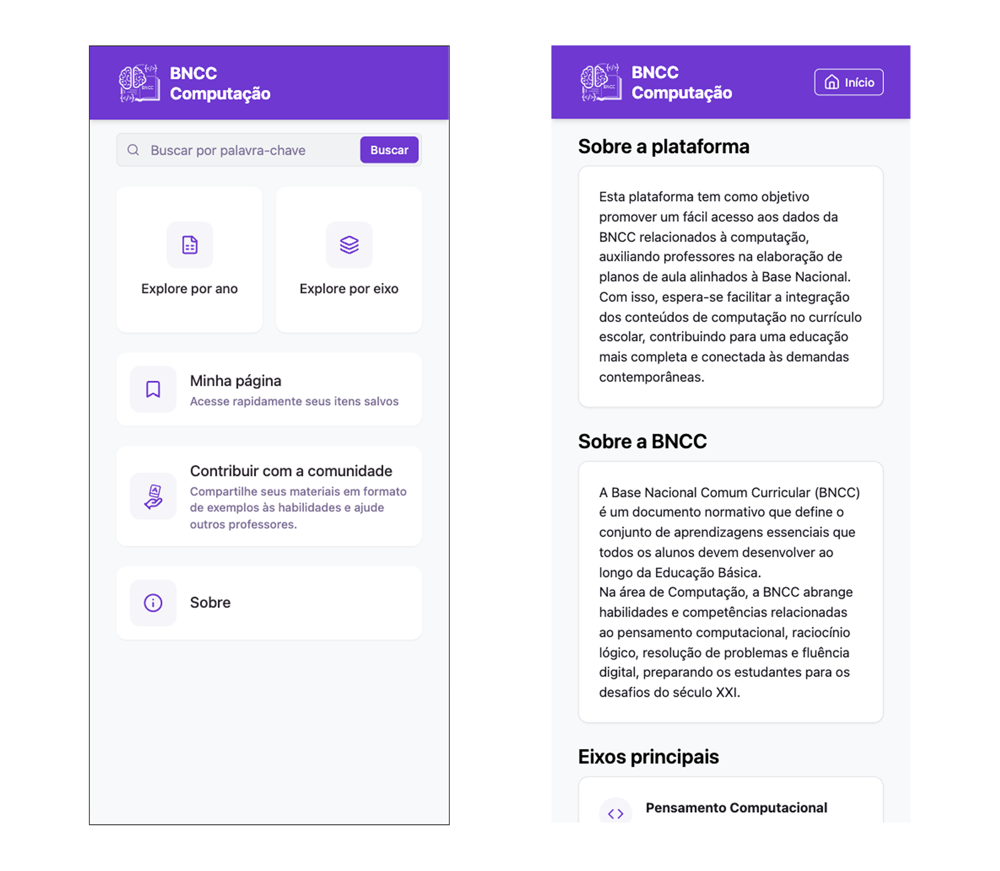
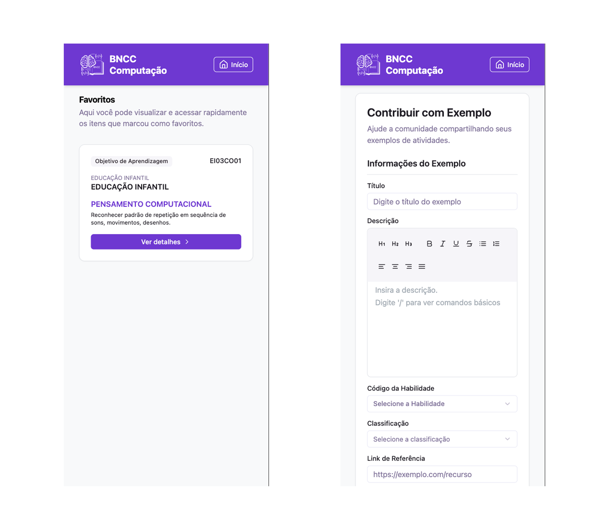
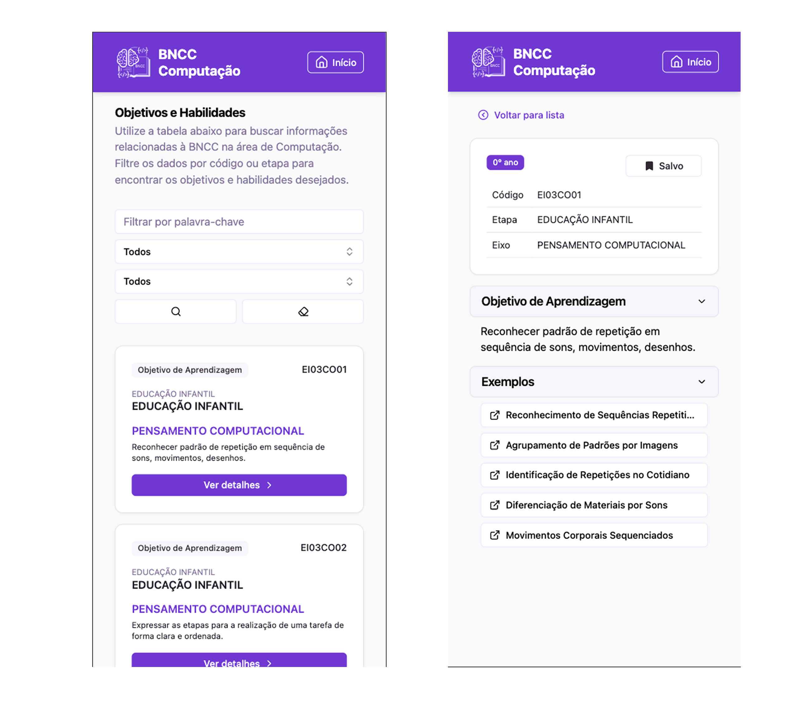
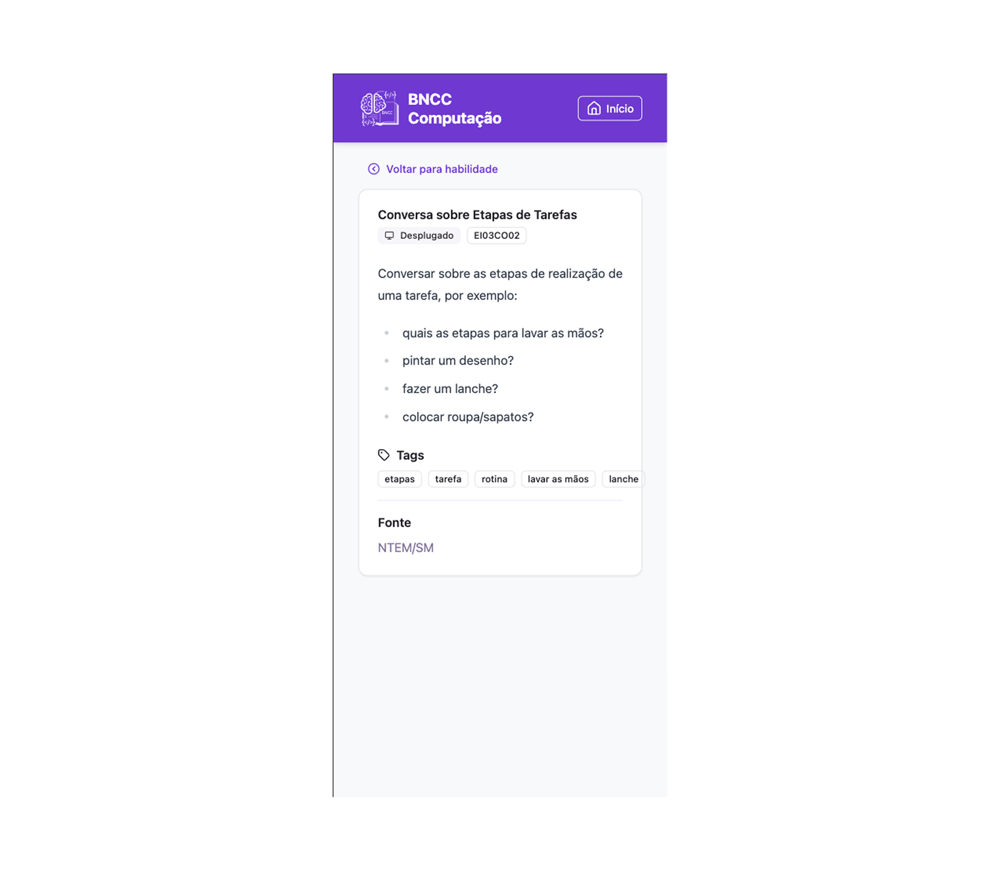

# BNCC Computação – Plataforma de Apoio

Projeto desenvolvido para o Trabalho de Conclusão de Curso, do Curso de Graduação em Sistemas de Informação pela Universidade Federal de Santa Maria - UFSM.

Plataforma web desenvolvida com React + Vite para auxiliar professores na implementação da BNCC Computação no contexto da educação básica. A ferramenta permite consultar habilidades, acessar exemplos de aplicação e colaborar com a comunidade educacional.







## 📦 Tecnologias Utilizadas

- [React 19](https://react.dev)
- [Vite](https://vitejs.dev/)
- [TypeScript](https://www.typescriptlang.org/)
- [Tailwind CSS](https://tailwindcss.com/)
- [React Router v7](https://reactrouter.com/)
- [React Hook Form](https://react-hook-form.com/)
- [TanStack React Query](https://tanstack.com/query/latest)
- [Tiptap Editor](https://tiptap.dev/)
- [Zod](https://github.com/colinhacks/zod)
- [Radix UI](https://www.radix-ui.com/)
- [Lucide Icons](https://lucide.dev/)

## 📁 Estrutura de Pastas

```
src/
├── api/           # Serviços de integração com backend
├── assets/        # Imagens e recursos estáticos
├── components/    # Componentes reutilizáveis
├── dtos/          # Tipagens de dados (Data Transfer Objects)
├── hooks/         # Hooks personalizados
├── layouts/       # Layouts base para páginas
├── lib/           # Funções auxiliares de bibliotecas
├── pages/         # Páginas principais da aplicação
├── router.tsx     # Configuração de rotas
├── providers.tsx  # Context providers (ex: tema, auth, query client)
├── env.ts         # Variáveis de ambiente e config
├── utils/         # Utilitários diversos
```

## 🚀 Como Executar

### 1. Pré-requisitos

- Node.js 18+
- [pnpm](https://pnpm.io/) instalado globalmente

### 2. Instalar dependências

```bash
pnpm install
```

### 3. Rodar ambiente de desenvolvimento

```bash
pnpm dev
```

### 4. Build de produção

```bash
pnpm build
```

### 5. Preview do build

```bash
pnpm preview
```

## 🌐 Hospedagem

O projeto está preparado para ser hospedado na [Vercel](https://vercel.com/), com configuração presente em `vercel.json`.

## 🤝 Contribuição

Contribuições são bem-vindas! Sinta-se à vontade para abrir _issues_ ou enviar _pull requests_ com melhorias e sugestões.